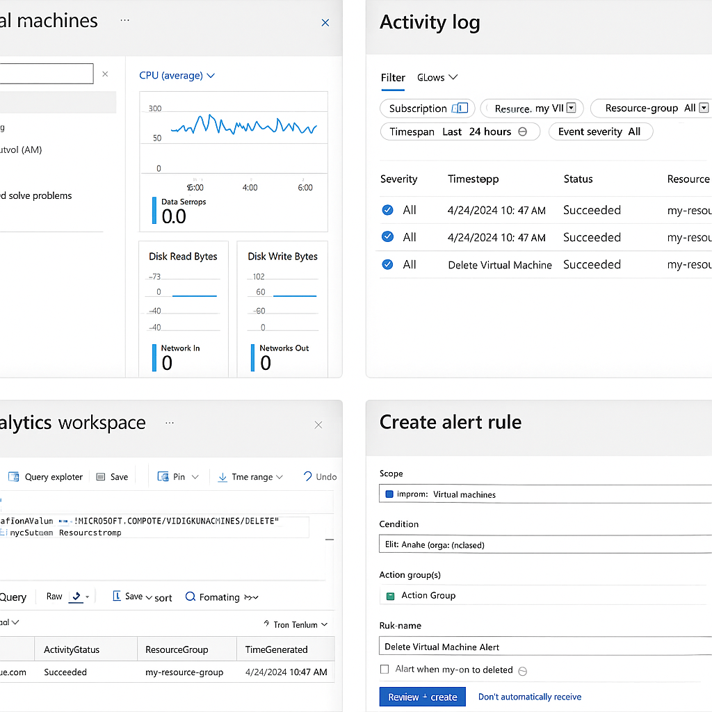

# 🔍 Laboratório de Monitoramento de Máquinas Virtuais no Azure — DIO

Este repositório documenta o desafio prático do módulo de monitoramento do Microsoft Azure na DIO.  
Aqui organizo anotações, conceitos-chave e um print ilustrativo usado para compreender o monitoramento de VMs utilizando **Azure Monitor**, **Activity Log**, **Log Analytics** e **alertas**.

---

## 🎯 Objetivos do Desafio

- Entender como o Azure Monitor coleta **métricas e logs**.
- Utilizar o **Activity Log** para rastrear exclusões e alterações críticas.
- Criar consultas em **KQL** no Log Analytics.
- Configurar **alertas** para eventos críticos.
- Documentar todo o processo de forma clara e estruturada.
- Publicar o material em um repositório GitHub.

---

## 🧩 Visão Geral do Monitoramento

A imagem em 
` representa um cenário típico de monitoramento de VMs no Azure, incluindo:

- Dashboard de **Virtual Machines** com métricas de CPU, disco e rede.
- Tela do **Activity Log** filtrando operações administrativas (como exclusão de VM).
- Tela do **Log Analytics** com consulta KQL para localizar eventos de exclusão.
- Tela de criação de **alertas** para eventos críticos.

Essa representação consolida os principais pontos trabalhados no laboratório, servindo como referência visual para revisões futuras.

---

## 🧪 Exemplos de Consultas KQL

### Verificação de status da VM (Heartbeat)

```kql
Heartbeat
| sort by TimeGenerated desc
```

### Filtrar exclusão de VM

```kql
AzureActivity
| where OperationNameValue == "MICROSOFT.COMPUTE/VIRTUALMACHINES/DELETE"
| project Caller, ActivityStatus, ResourceGroup, TimeGenerated
```

---

## 📁 Estrutura do Repositório

```text
/
├── README.md
└── images/
    └── monitoring-overview.png
```

---

## 📚 Referências

- Documentação Microsoft — Azure Monitor  
- Microsoft Learn — Log Analytics e KQL  
- Guia oficial GitHub – Markdown  

---

## 🧠 Observação Final

Este repositório serve como base de estudo e revisão para monitoramento em Azure  
e compõe meu portfólio de operação e observabilidade em nuvem.
